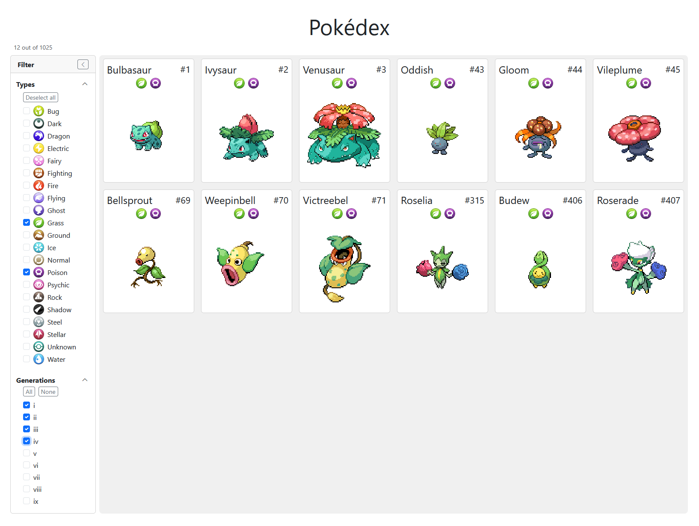
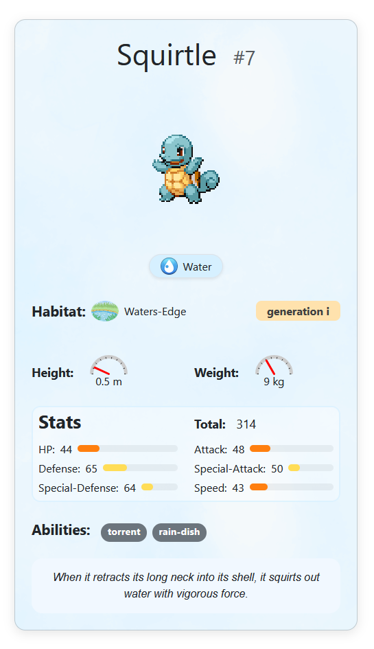

# 🧪 React Pokédex – Coding Task

This project was created as part of a coding task. The goal was to build a small Pokédex application using React, loading and displaying Pokémon data from the public [PokeAPI GraphQL](https://pokeapi.co/docs/graphql) endpoint.

<p align=center>
  
  
</p>


## 🔧 Tech Stack

- [React](https://react.dev/)
- [Vite](https://vitejs.dev/)
- [Bootstrap 5](https://getbootstrap.com/)
- [GraphQL](https://pokeapi.co/docs/graphql)

## 🚀 Features

- Automatically loads Pokémon from API on startup
- Displays each Pokémon's name, ID, image and types
- Filter by Pokémon types and generations (support for multiple selection)
- Detail view showing extended information about a selected Pokémon

## 🖥️ Getting Started

```bash
# Clone the repository
git clone https://github.com/your-username/pokeapi-react-app.git
cd pokeapi-react-app

# Install dependencies
npm install

# Start development server
npm run dev
